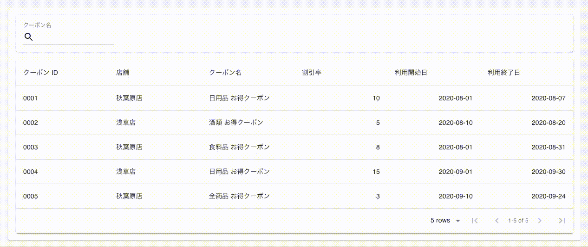

# material-table-filter-outside-the-table

[material-table](https://material-table.com/#/) でテーブルの外側にフィルターを設置する

## Demo



## Environment

```
$ sw_vers
ProductName:    Mac OS X
ProductVersion: 10.15.6
BuildVersion:   19G2021

$ node --version
v12.18.2

$ npm --version
6.14.5

$ yarn --version
1.22.4

$ npm --global list --depth=0
├── create-react-app@3.4.1

$ yarn list --depth=0
...

@material-ui/core@4.11.0
material-table@1.68.0
react@16.13.1
react-dom@16.13.1
typescript@3.7.5

...
```

## Usage

```
$ yarn install
$ yarn start
```
